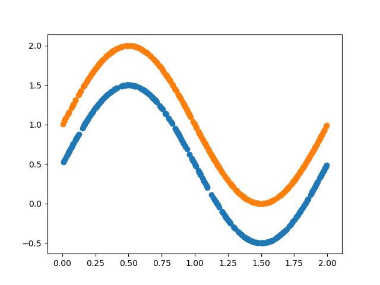
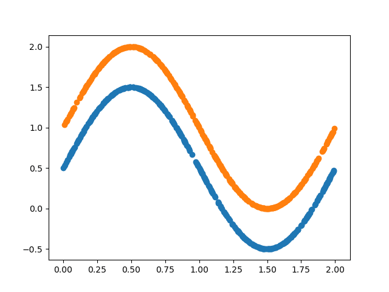

# mlpManifold
In this example I demonstrate how a multi layer perceptron can learns to change manifold of data distribution.

# Requirements
* keras
* tensorflow
* matplotlib
* numpy
* scipy


# Introduction
In general most deep learning models are trying to learn the manifold of data. Supervised algorithms are trying to learn to project data points into a new manifold so that they can seperate them to their corresponding classes. Similar to that Unsupervised alogrihtms for example auto-encoders and restricted restricted boltzman machines(RBM) are trying to project data points into a simpler manifold. However unsuvervised algorithms don't use label singal information a 

s they do in back propagation algorithm so that they can 

# Data Generation
we generate two classes data with similar manifolds in 2D space. They live in a sinusoid manifold with close borders so that it is not possible to seperate them linearly in original 2D space.
``` python
def gen_data(): 
    # generate data ....
    print('Genete data ...')
    X = np.arange(0, 2, 0.001)
    Y1 = 0.5 + np.sin(np.pi * X)
    Y2 = 1.0 + np.sin(np.pi * X) 
    XX = np.concatenate((X, X), axis=0)
    YY = np.concatenate((Y1,Y2),axis=0)
    XX = np.concatenate((np.expand_dims(XX,axis=1),np.expand_dims(YY,axis=1)),axis=1)
    YY = np.concatenate((np.zeros(X.shape[0]),np.ones(X.shape[0])),axis=0)
    idx = np.arange(XX.shape[0])
    idx_train, idx_test = train_test_split(idx, test_size=0.2)
    idx_train,idx_val = train_test_split(idx_train,test_size=0.2)
    Xtrain = XX[idx_train,]
    ytrain = YY[idx_train,]
    Xval = XX[idx_val,]
    yval = YY[idx_val,]
    Xtest = XX[idx_test,]
    ytest = YY[idx_test,]
    return Xtrain,ytrain,Xval,yval,Xtest,ytest
```
<p align="center">
  
</p>

# Training Model
Idefine a very simple mlp model with 2 layers.The non linearity of middle layer are rectified linear and last layer is sigmoid for binnary classification.I train the model by minimizing the cross-entropy of last layer and labels. During training we after each epoch we get the last layer representaion of model as the new manifold of data. Later I visualize these representations later.

``` python
def mlp_model():
    # define mlp model
    print('Build model...')
    inL = Input(shape=(2,))
    x = Dense(100,activation='relu',kernel_initializer=RandomNormal(mean=0.0, stddev=0.01, seed=77))(inL)
    x = Dense(2,activation='relu',kernel_initializer=RandomNormal(mean=0.0, stddev=0.01, seed=77))(x)
    out = Dense(1,activation='sigmoid',kernel_initializer=RandomNormal(mean=0.0, stddev=0.01, seed=77))(x)
    model = Model(inL,out)
    repmodel = Model(inL,x)
    print model.summary()
    return model,repmodel
``` 

# Results
We could se evolution of represention learned by the model. The mlp is trying to project them into a representation that can be seperated linearly in the last layer.
<p align="center">
  
</p>

